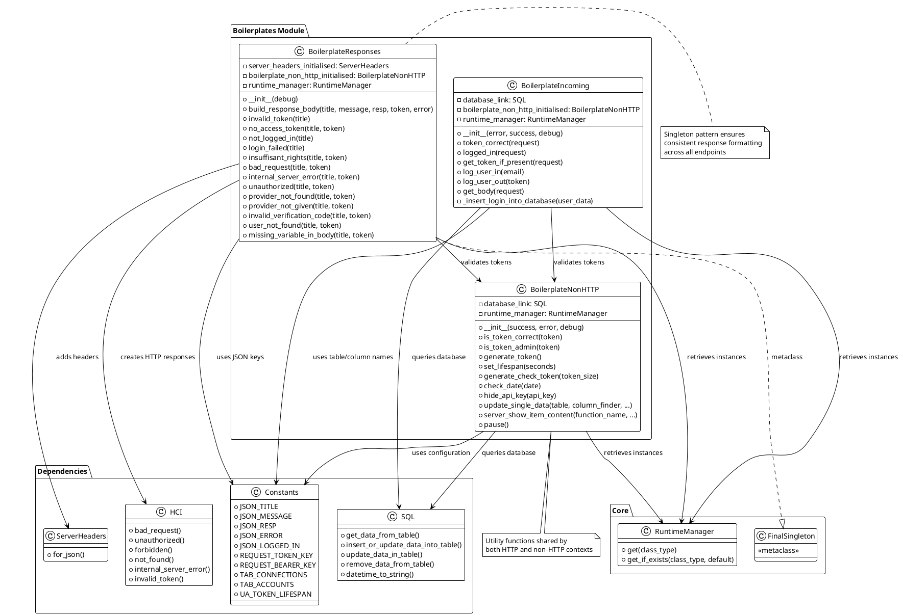
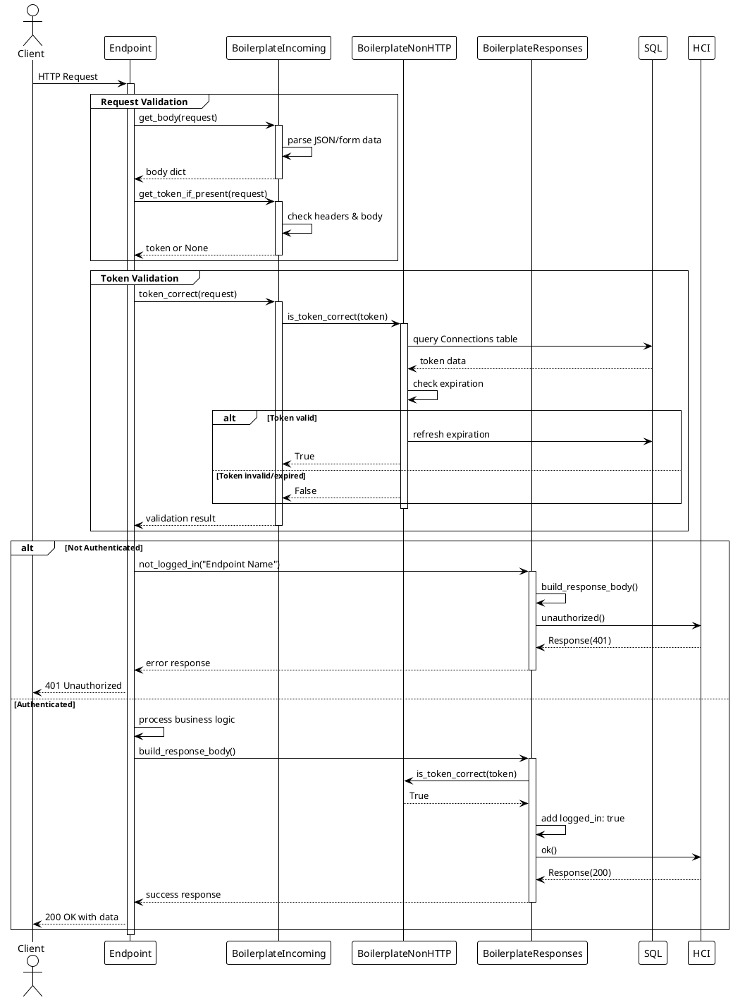

<!-- 
-- +==== BEGIN CatFeeder =================+
-- LOGO: 
-- ..........####...####..........
-- ......###.....#.#########......
-- ....##........#.###########....
-- ...#..........#.############...
-- ...#..........#.#####.######...
-- ..#.....##....#.###..#...####..
-- .#.....#.##...#.##..##########.
-- #.....##########....##...######
-- #.....#...##..#.##..####.######
-- .#...##....##.#.##..###..#####.
-- ..#.##......#.#.####...######..
-- ..#...........#.#############..
-- ..#...........#.#############..
-- ...##.........#.############...
-- ......#.......#.#########......
-- .......#......#.########.......
-- .........#####...#####.........
-- /STOP
-- PROJECT: CatFeeder
-- FILE: boilerplates.md
-- CREATION DATE: 02-12-2025
-- LAST Modified: 15:29:24 02-12-2025
-- DESCRIPTION: 
-- This is the project in charge of making the connected cat feeder project work.
-- /STOP
-- COPYRIGHT: (c) Cat Feeder
-- PURPOSE: The overview of the boilerplate classes.
-- // AR
-- +==== END CatFeeder =================+
-->
# Boilerplates

## Overview

The `Boilerplates` module provides standardized, reusable components for request handling and response generation in CatFeeder. It eliminates code duplication by offering three specialized classes that handle common patterns in HTTP APIs: response formatting, request validation, and non-HTTP utilities.

## Core Concept: Standardization

### The Problem

In a typical API backend:

- Response formats are inconsistent across endpoints
- Token validation is repeated in every endpoint
- Error responses are manually constructed
- Request body parsing varies by endpoint
- Common utilities (token generation, date handling) are scattered

### The Solution

The Boilerplates module provides three classes:

1. **BoilerplateResponses**: Standardized HTTP response builders
2. **BoilerplateIncoming**: Request validation and body parsing
3. **BoilerplateNonHTTP**: Non-HTTP utilities (tokens, dates, validation)

## Architecture



## 1. BoilerplateResponses

### Purpose

Provides standardized HTTP response builders for common scenarios (errors, authentication failures, etc.).

### Key Features

- **Consistent JSON structure** across all endpoints
- **Automatic token validation** in response bodies
- **Pre-built error responses** for common HTTP status codes
- **Singleton pattern** ensures consistency

### Core Method: `build_response_body()`

**Purpose**: Create standardized JSON response body

**Signature**:

```python
def build_response_body(
    self, 
    title: str, 
    message: str, 
    resp: Any, 
    token: Optional[str], 
    error: bool = False
) -> Dict[str, Any]
```

**Structure**:

```json
{
    "title": "Endpoint Name",
    "message": "Human-readable message",
    "resp": {...} or "error": {...},
    "logged_in": true/false/null
}
```

**Implementation**:

```python
def build_response_body(self, title, message, resp, token, error=False):
    json_body = {}
    json_body[CONST.JSON_TITLE] = title
    json_body[CONST.JSON_MESSAGE] = message
    
    # Use "error" key for errors, "resp" for success
    if error is False:
        json_body[CONST.JSON_RESP] = resp
    else:
        json_body[CONST.JSON_ERROR] = resp
    
    # Validate token and add login status
    if token:
        json_body[CONST.JSON_LOGGED_IN] = self.boilerplate_non_http_initialised.is_token_correct(token)
    else:
        json_body[CONST.JSON_LOGGED_IN] = False
    
    return json_body
```

### Pre-Built Response Methods

#### Authentication Errors

**`invalid_token(title: str) -> Response`**

```python
# Returns 401 Unauthorized
{
    "title": "Login Endpoint",
    "message": "The token you entered is invalid.",
    "error": "Invalid token",
    "logged_in": false
}
```

**`not_logged_in(title: str) -> Response`**

```python
# Returns 401 Unauthorized
{
    "title": "Protected Endpoint",
    "message": "You need to be logged in to be able to run this endpoint.",
    "error": "User not logged in",
    "logged_in": false
}
```

**`login_failed(title: str) -> Response`**

```python
# Returns 401 Unauthorized
{
    "title": "Login",
    "message": "Login failed, invalid credentials or username.",
    "error": "Invalid credentials or username.",
    "logged_in": false
}
```

#### Authorization Errors

**`insuffisant_rights(title: str, token: Optional[str]) -> Response`**

```python
# Returns 403 Forbidden
{
    "title": "Admin Panel",
    "message": "You do not have enough permissions to execute this endpoint.",
    "error": "Insufficient rights for given account.",
    "logged_in": true
}
```

**`unauthorized(title: str, token: Optional[str]) -> Response`**

```python
# Returns 401 Unauthorized
{
    "title": "Resource Access",
    "message": "You do not have permission to run this endpoint.",
    "error": "Access denied",
    "logged_in": false
}
```

#### Request Errors

**`bad_request(title: str, token: Optional[str]) -> Response`**

```python
# Returns 400 Bad Request
{
    "title": "Create User",
    "message": "The request was not formatted correctly.",
    "error": "Bad request",
    "logged_in": false
}
```

**`missing_variable_in_body(title: str, token: Optional[str]) -> Response`**

```python
# Returns 400 Bad Request
{
    "title": "Update Profile",
    "message": "A variable is missing in the body of the request.",
    "error": "Missing variable",
    "logged_in": false
}
```

#### Resource Errors

**`user_not_found(title: str, token: Optional[str]) -> Response`**

```python
# Returns 404 Not Found
{
    "title": "Get User",
    "message": "The current user was not found.",
    "error": "Not found",
    "logged_in": true
}
```

**`provider_not_found(title: str, token: Optional[str]) -> Response`**

```python
# Returns 404 Not Found
{
    "title": "OAuth Provider",
    "message": "The provider you are looking for was not found.",
    "error": "Provider not found",
    "logged_in": true
}
```

#### Server Errors

**`internal_server_error(title: str, token: Optional[str]) -> Response`**

```python
# Returns 500 Internal Server Error
{
    "title": "Data Processing",
    "message": "The server has encountered an error.",
    "error": "Internal server error",
    "logged_in": true
}
```

### Usage Example

```python
from backend.src.libs.boilerplates import BoilerplateResponses

# Initialize (singleton)
responses = BoilerplateResponses(debug=True)

# In an endpoint
async def protected_endpoint(request: Request):
    token = request.headers.get("Authorization")
    
    if not token:
        return responses.not_logged_in("Protected Endpoint")
    
    # Validate token
    if not is_valid(token):
        return responses.invalid_token("Protected Endpoint")
    
    # Success response
    body = responses.build_response_body(
        title="Protected Endpoint",
        message="Access granted",
        resp={"data": "sensitive_information"},
        token=token,
        error=False
    )
    return Response(content=body, status_code=200)
```

## 2. BoilerplateIncoming

### Purpose

Handles incoming request validation, token extraction, body parsing, and user authentication.

### Key Features

- **Token extraction** from headers (Bearer or direct)
- **Token validation** via database
- **User login/logout** functionality
- **Universal body parsing** (JSON and form data)
- **File upload handling**

### Core Methods

#### Token Handling

**`get_token_if_present(request: Request) -> Optional[str]`**

**Purpose**: Extract token from request headers

**Checks**:

1. Request body `token` key
2. Request body `bearer` key (strips "Bearer " prefix)
3. Request headers `Authorization` (Bearer token)
4. Request headers `token`

**Implementation**:

```python
def get_token_if_present(self, request: Request) -> Union[str, None]:
    mtoken = request.get(CONST.REQUEST_TOKEN_KEY)
    mbearer = request.get(CONST.REQUEST_BEARER_KEY)
    token = request.headers.get(CONST.REQUEST_TOKEN_KEY)
    bearer = request.headers.get(CONST.REQUEST_BEARER_KEY)
    
    if all(v is None for v in [mtoken, mbearer, token, bearer]):
        return None
    
    # Extract from Bearer token
    if mbearer and mbearer.startswith('Bearer '):
        return mbearer.split(" ")[1]
    if bearer and bearer.startswith('Bearer '):
        return bearer.split(" ")[1]
    
    # Direct token
    return token or mtoken
```

**`token_correct(request: Request) -> bool`**

**Purpose**: Validate token from request

**Process**:

1. Extract token using `get_token_if_present()`
2. Validate against database via `BoilerplateNonHTTP.is_token_correct()`
3. Return `True` if valid, `False` otherwise

#### User Authentication

**`log_user_in(email: str) -> Dict[str, Any]`**

**Purpose**: Create login session for user

**Process**:

1. Generate new token via `BoilerplateNonHTTP.generate_token()`
2. Retrieve user ID from database by email
3. Set token lifespan (e.g., 24 hours)
4. Insert login record into `Connections` table
5. Return status and token

**Returns**:

```python
{
    'status': 0,  # success
    'token': 'uuid-token-string'
}
# or
{
    'status': 84,  # error
    'token': ''
}
```

**Implementation**:

```python
def log_user_in(self, email: str) -> Dict[str, Any]:
    data = {'status': self.success, 'token': ''}
    
    # Generate token
    token = self.boilerplate_non_http_initialised.generate_token()
    
    # Get user ID
    usr_id = self.database_link.get_data_from_table(
        CONST.TAB_ACCOUNTS,
        "id",
        f"email='{email}'",
        beautify=False
    )
    
    if isinstance(usr_id, int):
        data['status'] = self.error
        return data
    
    # Set expiration
    lifespan = self.boilerplate_non_http_initialised.set_lifespan(
        CONST.UA_TOKEN_LIFESPAN
    )
    
    # Insert into database
    usr_data = [token, str(usr_id[0][0]), lifespan]
    data['status'] = self._insert_login_into_database(usr_data)
    data['token'] = token
    
    return data
```

**`log_user_out(token: str) -> Union[Dict[str, Any], bool]`**

**Purpose**: Terminate user session

**Process**:

1. Validate token exists in database
2. Remove token from `Connections` table
3. Return status

**Returns**:

```python
{
    'status': 0,  # success
    'msg': 'You have successfully logged out.'
}
# or
{
    'status': 84,  # error
    'msg': 'No token provided !'
}
```

#### Request Body Parsing

**`async get_body(request: Request) -> Dict[str, Any]`**

**Purpose**: Universal request body parser supporting JSON and form data

**Handles**:

- JSON bodies
- Form data (multipart/form-data)
- File uploads

**Implementation**:

```python
async def get_body(self, request: Request) -> Dict[str, Any]:
    body: Dict[str, Any] = {}
    
    try:
        # Try JSON first
        body = await request.json()
    except Exception:
        try:
            # Try form data
            form = await request.form()
            body = dict(form)
            
            # Handle file uploads
            files = await request.form()
            body["_files"] = {}
            
            for file_key, file_value in files.items():
                if isinstance(file_value, UploadFile):
                    body["_files"][file_key] = {
                        "filename": file_value.filename,
                        "content_type": file_value.content_type,
                        "content": await file_value.read()
                    }
        except Exception as form_error:
            body = {"error": f"Failed to parse request body: {str(form_error)}"}
    
    return body
```

### Usage Example

```python
from backend.src.libs.boilerplates import BoilerplateIncoming
from fastapi import Request

incoming = BoilerplateIncoming(debug=True)

async def login_endpoint(request: Request):
    # Parse body
    body = await incoming.get_body(request)
    email = body.get("email")
    
    # Authenticate user
    result = incoming.log_user_in(email)
    
    if result['status'] == 0:
        return {"success": True, "token": result['token']}
    else:
        return {"success": False, "message": "Login failed"}

async def protected_endpoint(request: Request):
    # Check authentication
    if not incoming.token_correct(request):
        return {"error": "Not authenticated"}
    
    # Process request
    return {"data": "protected_data"}
```

## 3. BoilerplateNonHTTP

### Purpose

Provides utility functions that don't directly involve HTTP requests/responses but are used throughout the application.

### Key Features

- **Token management** (generation, validation, expiration)
- **Date/time utilities**
- **Validation helpers** (dates, formats)
- **Database utilities**
- **Security helpers** (API key hiding)

### Core Methods

#### Token Management

**`generate_token() -> str`**

**Purpose**: Generate unique UUID-based user token

**Process**:

1. Generate UUID v4
2. Check uniqueness against database
3. Regenerate if collision detected
4. Return unique token

**Implementation**:

```python
def generate_token(self) -> str:
    token = str(uuid.uuid4())
    
    # Check database for uniqueness
    user_token = self.database_link.get_data_from_table(
        table=CONST.TAB_CONNECTIONS,
        column="token",
        where=f"token='{token}'",
        beautify=False
    )
    
    # Regenerate if exists
    while not isinstance(user_token, int):
        token = str(uuid.uuid4())
        user_token = self.database_link.get_data_from_table(...)
    
    return token
```

**`is_token_correct(token: str) -> bool`**

**Purpose**: Validate token and refresh expiration

**Process**:

1. Query database for token
2. Check expiration date
3. If valid and not expired:
   - Refresh expiration date
   - Update database
4. Return `True` if valid, `False` otherwise

**Implementation**:

```python
def is_token_correct(self, token: str) -> bool:
    if not isinstance(token, str):
        return False
    
    # Query database
    login_table = self.database_link.get_data_from_table(
        CONST.TAB_CONNECTIONS,
        "*",
        where=f"token={token}",
        beautify=False
    )
    
    if isinstance(login_table, int) or len(login_table) != 1:
        return False
    
    # Check expiration
    if datetime.now() > login_table[0][-1]:
        return False
    
    # Refresh expiration
    new_date = self.set_lifespan(CONST.UA_TOKEN_LIFESPAN)
    new_date_str = self.database_link.datetime_to_string(new_date, ...)
    
    self.database_link.update_data_in_table(
        table=CONST.TAB_CONNECTIONS,
        data=[new_date_str],
        column=["expiration_date"],
        where=f"token={token}"
    )
    
    return True
```

**`set_lifespan(seconds: int) -> datetime`**

**Purpose**: Calculate token expiration datetime

**Implementation**:

```python
def set_lifespan(self, seconds: int) -> datetime:
    current_time = datetime.now()
    offset_time = current_time + timedelta(seconds=seconds)
    return offset_time
```

#### Validation Utilities

**`check_date(date: str) -> bool`**

**Purpose**: Validate date format (DD/MM/YYYY)

**Implementation**:

```python
def check_date(self, date: str = "DD/MM/YYYY") -> bool:
    pattern = re.compile(
        r"^(0[1-9]|[12][0-9]|3[01])/(0[1-9]|1[0-2])/\d{4}$"
    )
    return bool(pattern.match(date))
```

**`generate_check_token(token_size: int = 4) -> str`**

**Purpose**: Generate verification code (e.g., for email verification)

**Format**: `1234-5678-9012-3456` (4-digit groups)

**Implementation**:

```python
def generate_check_token(self, token_size: int = 4) -> str:
    token_size = max(int(token_size), 0)
    
    code = f"{randint(CONST.RANDOM_MIN, CONST.RANDOM_MAX)}"
    for i in range(token_size):
        code += f"-{randint(CONST.RANDOM_MIN, CONST.RANDOM_MAX)}"
    
    return code
```

#### Security Utilities

**`hide_api_key(api_key: str) -> str`**

**Purpose**: Obscure API keys in logs/responses

**Implementation**:

```python
def hide_api_key(self, api_key: str) -> str:
    if api_key is None:
        return "No api key"
    else:
        return "Some api key"
```

### Usage Example

```python
from backend.src.libs.boilerplates import BoilerplateNonHTTP

non_http = BoilerplateNonHTTP(debug=True)

# Token management
token = non_http.generate_token()
is_valid = non_http.is_token_correct(token)

# Date validation
if non_http.check_date("25/12/2025"):
    print("Valid date")

# Verification codes
code = non_http.generate_check_token(4)  # "1234-5678-9012-3456"

# Token expiration
expires_at = non_http.set_lifespan(86400)  # 24 hours from now
```

## Request/Response Flow



## Design Patterns

### Singleton Pattern (BoilerplateResponses)

Uses `FinalSingleton` metaclass to ensure single instance:

```python
class BoilerplateResponses(FinalSingleton):
    def __init__(self, debug: bool = False):
        super().__init__()
        # Initialize once
```

**Benefits**:

- Consistent response formatting
- Shared configuration
- Reduced memory footprint

### Composition Over Inheritance

All classes use composition to access dependencies:

```python
self.runtime_manager = RI
self.database_link = self.runtime_manager.get(SQL)
self.boilerplate_non_http_initialised = self.runtime_manager.get_if_exists(...)
```

### Separation of Concerns

- **BoilerplateResponses**: HTTP response creation
- **BoilerplateIncoming**: Request processing
- **BoilerplateNonHTTP**: Business logic utilities

## Integration with Other Modules

### With Endpoints

```python
# In endpoint implementation
from backend.src.libs.boilerplates import (
    BoilerplateResponses, 
    BoilerplateIncoming
)

class UserEndpoints:
    def __init__(self):
        self.responses = BoilerplateResponses(debug=True)
        self.incoming = BoilerplateIncoming(debug=True)
    
    async def get_user(self, request: Request):
        # Validate token
        if not self.incoming.token_correct(request):
            return self.responses.not_logged_in("Get User")
        
        # Parse body
        body = await self.incoming.get_body(request)
        
        # Process...
        return self.responses.build_response_body(...)
```

### With PathManager/EndpointManager

Boilerplates are used within endpoint handlers registered via PathManager:

```python
# EndpointManager registers endpoints
path_manager.add_path("/api/v1/users", user_endpoints.get_user, "GET")

# user_endpoints.get_user internally uses Boilerplates
```

## Constants Reference

### JSON Response Keys

- `JSON_TITLE`: Response title field
- `JSON_MESSAGE`: Human-readable message
- `JSON_RESP`: Success response data
- `JSON_ERROR`: Error response data
- `JSON_LOGGED_IN`: Authentication status (true/false/null)

### Request Keys

- `REQUEST_TOKEN_KEY`: "token"
- `REQUEST_BEARER_KEY`: "Authorization"

### Database Tables

- `TAB_CONNECTIONS`: User login sessions
- `TAB_ACCOUNTS`: User account data

### Configuration

- `UA_TOKEN_LIFESPAN`: Token validity duration (seconds)
- `RANDOM_MIN`: Minimum for verification codes
- `RANDOM_MAX`: Maximum for verification codes

## Benefits

1. **Consistency**: Standardized responses across all endpoints
2. **Reusability**: Common patterns implemented once
3. **Maintainability**: Changes to response format in one place
4. **Type Safety**: Validated inputs and outputs
5. **Security**: Centralized token validation and API key hiding
6. **Flexibility**: Supports JSON, form data, and file uploads
7. **Error Handling**: Pre-built error responses reduce boilerplate

## See Also

- [EndpointManager](../endpoint_manager/endpoint_manager.md) - Uses boilerplates in endpoints
- [PathManager](../path_manager/path_manager.md) - Route registration
- [SQL](../sql/sql.md) - Database operations
- [ServerHeaders](../server_header/server_header.md) - HTTP headers
- [HTTPCodes](../http_codes/http_codes.md) - Status code management

## Usage Best Practices

### 1. Always Use Boilerplates for Responses

```python
# ✅ Good
return responses.not_logged_in("Endpoint Name")

# ❌ Bad
return Response(
    content={"error": "not logged in"},
    status_code=401
)
```

### 2. Validate Tokens at Endpoint Entry

```python
async def protected_endpoint(request: Request):
    # First thing: validate token
    if not incoming.token_correct(request):
        return responses.not_logged_in("Protected Endpoint")
    
    # Continue with logic...
```

### 3. Use Universal Body Parser

```python
# ✅ Good - handles JSON and forms
body = await incoming.get_body(request)

# ❌ Bad - only handles JSON
body = await request.json()
```

### 4. Generate Unique Tokens

```python
# ✅ Good - checks uniqueness
token = non_http.generate_token()

# ❌ Bad - may collide
token = str(uuid.uuid4())
```

## Error Handling

All boilerplate methods handle errors gracefully:

```python
# Database errors
if isinstance(result, int):
    return self.error

# Missing instances
if not self.boilerplate_non_http_initialised:
    raise RuntimeError("Token validation service unavailable")

# Parse errors
try:
    body = await request.json()
except Exception:
    body = {"error": "Parse failed"}
```
