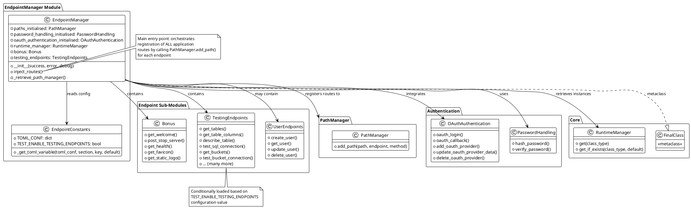
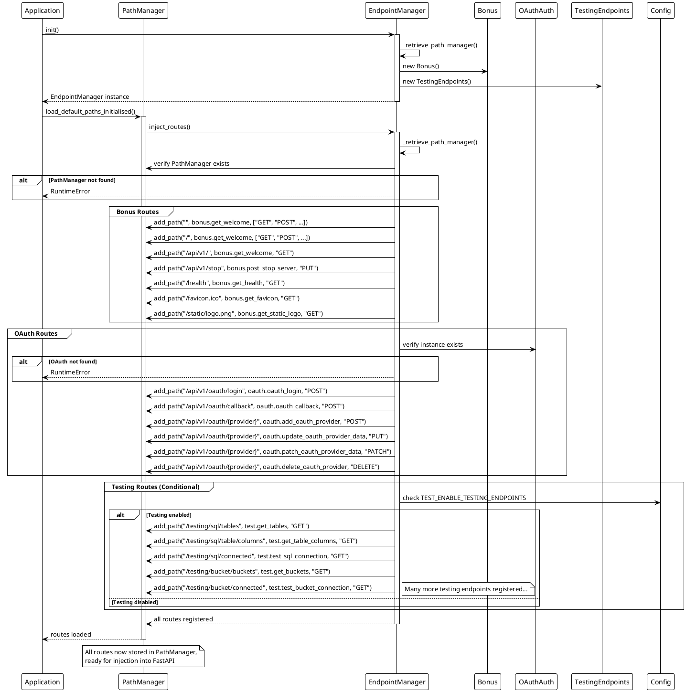

<!-- 
-- +==== BEGIN CatFeeder =================+
-- LOGO: 
-- ..........####...####..........
-- ......###.....#.#########......
-- ....##........#.###########....
-- ...#..........#.############...
-- ...#..........#.#####.######...
-- ..#.....##....#.###..#...####..
-- .#.....#.##...#.##..##########.
-- #.....##########....##...######
-- #.....#...##..#.##..####.######
-- .#...##....##.#.##..###..#####.
-- ..#.##......#.#.####...######..
-- ..#...........#.#############..
-- ..#...........#.#############..
-- ...##.........#.############...
-- ......#.......#.#########......
-- .......#......#.########.......
-- .........#####...#####.........
-- /STOP
-- PROJECT: CatFeeder
-- FILE: endpoint_manager.md
-- CREATION DATE: 02-12-2025
-- LAST Modified: 10:35:23 04-12-2025
-- DESCRIPTION: 
-- This is the project in charge of making the connected cat feeder project work.
-- /STOP
-- COPYRIGHT: (c) Cat Feeder
-- PURPOSE: The poverview of hte Endpoint manager.
-- // AR
-- +==== END CatFeeder =================+
-->
# EndpointManager

## Overview

The `EndpointManager` is the central coordinator for application-wide route registration in CatFeeder. It acts as a **route aggregator** that collects all endpoint definitions from various sub-modules and registers them with the `PathManager`. This creates a clean separation between route definition and route registration.

## Core Concept: Route Aggregation

### The Problem

In a large application:

- Endpoints are spread across multiple modules (user management, authentication, testing, etc.)
- Each module needs to register its routes with the system
- Route registration logic needs to be centralized but flexible
- Conditional route loading (e.g., test endpoints) must be supported

### The Solution

`EndpointManager` provides:

- **Centralized route registration** through a single `inject_routes()` method
- **Modular endpoint organization** via sub-classes (Bonus, TestingEndpoints, etc.)
- **Conditional loading** based on configuration
- **Integration with PathManager** for deferred registration

## Architecture



## Key Components

### EndpointManager Class

**Purpose**: Centralized coordinator for all application routes

**Responsibilities**:

1. Initialize endpoint sub-modules (Bonus, TestingEndpoints, etc.)
2. Retrieve PathManager instance from RuntimeManager
3. Register all application routes via `inject_routes()`
4. Handle OAuth authentication endpoints
5. Support conditional endpoint loading

### Endpoint Sub-Modules

#### Bonus

Core application endpoints:

- Welcome/root endpoints (`/`, `/api/v1/`)
- Server control (`/api/v1/stop`)
- Health checks (`/health`)
- Static assets (`/favicon.ico`, `/static/logo.png`)

#### TestingEndpoints

Development and testing utilities (conditionally loaded):

- SQL testing endpoints (`/testing/sql/*`)
- Bucket testing endpoints (`/testing/bucket/*`)
- Database introspection
- Connection testing

#### UserEndpoints

User management (referenced in structure but implementation may vary)

## Core Methods

### `__init__(success: int = 0, error: int = 84, debug: bool = False)`

Initializes EndpointManager with:

```python
def __init__(self, success: int = 0, error: int = 84, debug: bool = False):
    # Initialize logging
    self.disp.update_disp_debug(debug)
    
    # Store configuration
    self.success = success
    self.error = error
    self.debug = debug
    
    # Get RuntimeManager singleton
    self.runtime_manager = RI
    
    # Initialize authentication
    self.password_handling_initialised = PasswordHandling(...)
    
    # Retrieve PathManager
    self._retrieve_path_manager()
    
    # Get OAuth authentication
    self.oauth_authentication_initialised = self.runtime_manager.get_if_exists(
        OAuthAuthentication, None
    )
    
    # Initialize endpoint sub-modules
    self.bonus = Bonus(success, error, debug)
    self.testing_endpoints = TestingEndpoints(success, error, debug)
```

### `_retrieve_path_manager() -> Optional[PathManager]`

**Purpose**: Safely retrieve PathManager instance from RuntimeManager

**Behavior**:

- Returns existing `paths_initialised` if already cached
- Attempts to retrieve from RuntimeManager if not cached
- Returns `None` if PathManager doesn't exist yet

**Implementation**:

```python
def _retrieve_path_manager(self) -> Optional[PathManager]:
    if self.paths_initialised is not None:
        return self.paths_initialised
    if self.runtime_manager.exists(PathManager):
        self.paths_initialised = self.runtime_manager.get(PathManager)
        return self.paths_initialised
    return None
```

### `inject_routes() -> None`

**Purpose**: The main route registration method - registers ALL application endpoints

**Process**:

1. **Retrieve PathManager**:

   ```python
   self._retrieve_path_manager()
   if not self.paths_initialised:
       raise RuntimeError("PathManager could not be found")
   ```

2. **Register Bonus Routes**:

   ```python
   # Root endpoints (all HTTP methods)
   self.paths_initialised.add_path(
       "", self.bonus.get_welcome, 
       ["GET", "POST", "PUT", "PATCH", "DELETE", "HEAD", "OPTIONS"]
   )
   
   # API endpoints
   self.paths_initialised.add_path("/api/v1/", self.bonus.get_welcome, "GET")
   self.paths_initialised.add_path("/api/v1/stop", self.bonus.post_stop_server, "PUT")
   self.paths_initialised.add_path("/health", self.bonus.get_health, "GET")
   ```

3. **Register OAuth Routes**:

   ```python
   self.paths_initialised.add_path(
       "/api/v1/oauth/login", 
       self.oauth_authentication_initialised.oauth_login, 
       "POST"
   )
   self.paths_initialised.add_path(
       "/api/v1/oauth/{provider}", 
       self.oauth_authentication_initialised.add_oauth_provider, 
       "POST"
   )
   # ... more OAuth routes
   ```

4. **Conditionally Register Testing Routes**:

   ```python
   if ENDPOINT_CONST.TEST_ENABLE_TESTING_ENDPOINTS:
       self.paths_initialised.add_path(
           "/testing/sql/tables", 
           self.testing_endpoints.get_tables, 
           "GET"
       )
       # ... many more testing routes
   ```

**Raises**: `RuntimeError` if PathManager or OAuthAuthentication are missing

## Route Registration Flow



## Configuration

### TOML Configuration Loading

EndpointManager uses a configuration file (`config.toml`) to control behavior:

```python
# From endpoint_constants.py
TOML_CONF = toml.load("config.toml")

def _get_toml_variable(toml_conf: dict, section: str, key: str, default=None):
    """
    Get configuration value from TOML file.
    
    Args:
        toml_conf: Loaded TOML configuration dictionary
        section: Section path (e.g., "Test" or "Database.Connection")
        key: Key within section
        default: Default value if not found
    
    Returns:
        Configuration value or default
    """
    # Navigate nested sections
    keys = section.split('.')
    current_section = toml_conf
    
    for k in keys:
        if k in current_section:
            current_section = current_section[k]
        else:
            return default
    
    # Return value or default
    return current_section.get(key, default)
```

### Testing Endpoints Configuration

```python
TEST_ENABLE_TESTING_ENDPOINTS = _get_toml_variable(
    TOML_CONF, "Test", "enable_testing_endpoints", False
)
```

**Example config.toml**:

```toml
[Test]
enable_testing_endpoints = false  # Set to true in development
```

## Registered Routes

### Core Routes (Always Loaded)

| Path | Method(s) | Handler | Description |
|------|-----------|---------|-------------|
| `/` | ALL | `bonus.get_welcome` | Root welcome page |
| `` | ALL | `bonus.get_welcome` | Empty path (same as root) |
| `/api/v1/` | GET | `bonus.get_welcome` | API version root |
| `/api/v1/stop` | PUT | `bonus.post_stop_server` | Graceful server shutdown |
| `/health` | GET | `bonus.get_health` | Health check endpoint |
| `/favicon.ico` | GET | `bonus.get_favicon` | Favicon asset |
| `/static/logo.png` | GET | `bonus.get_static_logo` | Logo asset |

### OAuth Routes (Always Loaded)

| Path | Method | Handler | Description |
|------|--------|---------|-------------|
| `/api/v1/oauth/login` | POST | `oauth_login` | Initiate OAuth login |
| `/api/v1/oauth/callback` | POST | `oauth_callback` | OAuth callback handler |
| `/api/v1/oauth/{provider}` | POST | `add_oauth_provider` | Add new OAuth provider |
| `/api/v1/oauth/{provider}` | PUT | `update_oauth_provider_data` | Update provider (full) |
| `/api/v1/oauth/{provider}` | PATCH | `patch_oauth_provider_data` | Update provider (partial) |
| `/api/v1/oauth/{provider}` | DELETE | `delete_oauth_provider` | Remove provider |

### Testing Routes (Conditional)

**SQL Testing** (`/testing/sql/*`):

| Path | Method | Handler | Description |
|------|--------|---------|-------------|
| `/testing/sql/tables` | GET | `get_tables` | List all database tables |
| `/testing/sql/table/columns` | GET | `get_table_columns` | Get table column names |
| `/testing/sql/table/describe` | GET | `describe_table` | Describe table structure |
| `/testing/sql/table/size` | GET | `get_table_size` | Get table row count |
| `/testing/sql/version` | GET | `get_database_version` | Database version info |
| `/testing/sql/connected` | GET | `test_sql_connection` | Test DB connection |
| `/testing/sql/triggers` | GET | `get_triggers` | List all triggers |
| `/testing/sql/triggers/names` | GET | `get_trigger_names` | Get trigger names only |
| `/testing/sql/datetime/now` | GET | `get_current_datetime` | Current datetime |
| `/testing/sql/datetime/today` | GET | `get_current_date` | Current date |
| `/testing/sql/datetime/to-string` | GET | `convert_datetime_to_string` | Format datetime |
| `/testing/sql/datetime/from-string` | GET | `convert_string_to_datetime` | Parse datetime |

**Bucket Testing** (`/testing/bucket/*`):

| Path | Method | Handler | Description |
|------|--------|---------|-------------|
| `/testing/bucket/buckets` | GET | `get_buckets` | List all buckets |
| `/testing/bucket/connected` | GET | `test_bucket_connection` | Test bucket connection |
| `/testing/bucket/files` | GET | `get_bucket_files` | List files in bucket |
| `/testing/bucket/files/info` | GET | `get_bucket_file_info` | Get file metadata |
| `/testing/bucket/create` | POST | `create_test_bucket` | Create test bucket |
| `/testing/bucket/delete` | DELETE | `delete_test_bucket` | Delete test bucket |

## Integration with PathManager

EndpointManager **consumes** PathManager's deferred registration capabilities:

1. **EndpointManager defines WHAT routes exist** (paths, handlers, methods)
2. **PathManager stores HOW to register them** (deferred until FastAPI is ready)
3. **EndpointManager calls PathManager.add_path()** for each route
4. **PathManager later calls FastAPI.add_api_route()** when injecting

**Key relationship**:

```python
# EndpointManager (defines routes)
class EndpointManager:
    def inject_routes(self):
        self.paths_initialised.add_path("/health", self.bonus.get_health, "GET")

# PathManager (stores and injects routes)
class PathManager:
    def add_path(self, path, endpoint, method):
        self.routes.append({...})  # Store for later
    
    def inject_routes(self):
        for route in self.routes:
            app.add_api_route(...)  # Inject into FastAPI
```

## Error Handling

### Missing PathManager

```python
def inject_routes(self):
    if not self.paths_initialised:
        error_message = "PathManager could not be found"
        self.disp.log_critical(error_message)
        raise RuntimeError(error_message)
```

### Missing OAuth Authentication

```python
if not self.oauth_authentication_initialised:
    self.disp.log_error("OAuth Authentication is missing")
    raise RuntimeError("Token validation service unavailable")
```

### Configuration Errors

The `_get_toml_variable` function handles missing configuration gracefully:

```python
try:
    return current_section[key]
except KeyError:
    if default is None:
        raise KeyError(f"Key '{key}' not found in section '{section}'")
    return default
```

## Design Patterns

### Final Class Pattern

Like PathManager, EndpointManager uses `FinalClass` metaclass:

```python
class EndpointManager(metaclass=FinalClass):
    ...
```

This prevents inheritance and ensures the route aggregation logic remains centralized.

### Composition Pattern

EndpointManager composes endpoint sub-modules rather than inheriting from them:

```python
self.bonus = Bonus(success, error, debug)
self.testing_endpoints = TestingEndpoints(success, error, debug)
```

This provides flexibility and clear separation of concerns.

### Lazy Initialization

PathManager retrieval uses lazy initialization:

```python
def _retrieve_path_manager(self):
    if self.paths_initialised is not None:
        return self.paths_initialised  # Use cached
    # Otherwise retrieve from RuntimeManager
```

## Usage Example

### Basic Initialization

```python
from backend.src.libs.endpoint_manager import EndpointManager
from backend.src.libs.path_manager import PathManager

# Initialize managers
path_manager = PathManager(debug=True)
endpoint_manager = EndpointManager(debug=True)

# Register all application routes
endpoint_manager.inject_routes()

# Later, inject into FastAPI
path_manager.inject_routes()
```

### Typical Application Flow

```python
# 1. Application startup
app = FastAPI()

# 2. Initialize RuntimeManager with app
runtime_control = RuntimeControl(app)

# 3. Create PathManager
path_manager = PathManager(debug=True)

# 4. Create EndpointManager (automatically registers with PathManager)
endpoint_manager = EndpointManager(debug=True)

# 5. Load all routes from EndpointManager
path_manager.load_default_paths_initialised()

# 6. Inject routes into FastAPI
path_manager.inject_routes()

# 7. Start server
uvicorn.run(app)
```

## Benefits

1. **Centralized Management**: Single location for all route definitions
2. **Modular Organization**: Endpoints grouped by functionality
3. **Conditional Loading**: Test endpoints only in development
4. **Clean Separation**: Route definition separate from registration
5. **Maintainability**: Easy to add/remove endpoints
6. **Configuration-Driven**: Behavior controlled by config file
7. **Type Safety**: Integration with PathManager's validation

## See Also

- [PathManager](../path_manager/path_manager.md) - Deferred route registration system
- [Boilerplates](../boilerplates/boilerplates.md) - Standardized request/response handling
- [Core](../core/core.md) - RuntimeManager integration
- [OAuth Authentication](../oauth/oauth.md) - OAuth endpoint implementation

## Dependencies

### Required

- `PathManager` - For route registration
- `RuntimeManager` - For instance management
- `OAuthAuthentication` - For OAuth endpoints
- `PasswordHandling` - For authentication utilities

### Optional

- `Bonus` - Core application endpoints
- `TestingEndpoints` - Development/testing utilities
- Configuration file (`config.toml`) - For conditional loading
