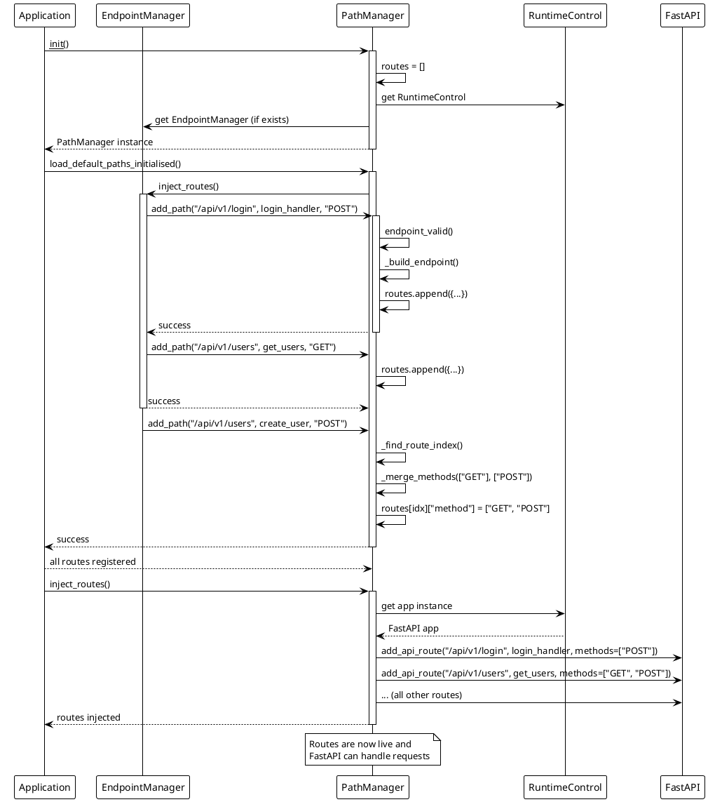

<!-- 
-- +==== BEGIN AsperBackend =================+
-- LOGO: 
-- ..........####...####..........
-- ......###.....#.#########......
-- ....##........#.###########....
-- ...#..........#.############...
-- ...#..........#.#####.######...
-- ..#.....##....#.###..#...####..
-- .#.....#.##...#.##..##########.
-- #.....##########....##...######
-- #.....#...##..#.##..####.######
-- .#...##....##.#.##..###..#####.
-- ..#.##......#.#.####...######..
-- ..#...........#.#############..
-- ..#...........#.#############..
-- ...##.........#.############...
-- ......#.......#.#########......
-- .......#......#.########.......
-- .........#####...#####.........
-- /STOP
-- PROJECT: AsperBackend
-- FILE: path_manager.md
-- CREATION DATE: 02-12-2025
-- LAST Modified: 14:35:7 02-12-2025
-- DESCRIPTION: 
-- This is the backend server in charge of making the actual website work.
-- /STOP
-- COPYRIGHT: (c) Asperguide
-- PURPOSE: Overview of the PathManager library (the one in charge of handling server endpoints).
-- // AR
-- +==== END AsperBackend =================+
-->
# PathManager

## Overview

The `PathManager` is a critical component of the AsperBackend routing system that implements a **deferred route registration pattern**. It allows routes to be defined and registered BEFORE the FastAPI application instance exists, storing them in memory until they can be injected into the FastAPI app at initialization time.

## Core Concept: Deferred Registration

### The Problem

In traditional FastAPI applications, routes must be added directly to an existing FastAPI app instance using decorators or `app.add_api_route()`. This creates a chicken-and-egg problem when:

- Routes need to be organized across multiple modules
- The FastAPI app instance doesn't exist yet during configuration
- A centralized route management system is needed

### The Solution

`PathManager` solves this by implementing a two-phase approach:

1. **Registration Phase**: Routes are validated and stored in an internal list
2. **Injection Phase**: All stored routes are bulk-injected into FastAPI when the app is ready

## Architecture

```plantuml
@startuml path_manager_architecture.puml
!theme plain

package "PathManager Module" {
  class PathManager {
    - routes: List[Dict[str, Any]]
    - runtime_manager_initialised: RuntimeManager
    - endpoints_initialised: EndpointManager
    - runtime_control_initialised: RuntimeControl
    + __init__(success, error, debug)
    + add_path(path, endpoint, method)
    + has_endpoint(path, endpoint, method)
    + load_default_paths_initialised()
    + inject_routes()
    - endpoint_valid(path, endpoint, method)
    - _build_endpoint(path, endpoint, method)
    - _find_route_index(path, endpoint)
    - _merge_methods(existing, new)
  }

  class PathConstants {
    + PATH_KEY: str = "path"
    + ENDPOINT_KEY: str = "endpoint"
    + METHOD_KEY: str = "method"
    + ALLOWED_METHODS: List[str]
  }
}

package "Core" {
  class RuntimeManager {
    + get(class_type)
    + get_if_exists(class_type, default)
    + exists(class_type)
  }

  class RuntimeControl {
    + app: FastAPI
  }

  class FinalClass {
    <<metaclass>>
  }
}

package "EndpointManager" {
  class EndpointManager {
    + inject_routes()
  }
}

PathManager --> PathConstants : uses
PathManager --> RuntimeManager : retrieves instances
PathManager --> RuntimeControl : accesses FastAPI app
PathManager --> EndpointManager : loads routes from
PathManager ..|> FinalClass : metaclass
PathManager --> "FastAPI" : injects routes into

note right of PathManager::routes
  Internal storage for deferred routes
  Structure: [
    {
      "path": "/api/v1/users",
      "endpoint": function_ref,
      "method": ["GET", "POST"]
    }
  ]
end note

note bottom of PathManager::inject_routes
  Final step: injects all stored
  routes into FastAPI app instance
end note

@enduml
```

## Key Components

### Route Storage Structure

Each route is stored as a dictionary with three keys:

```python
{
    "path": str,        # The URL path (e.g., "/api/v1/users")
    "endpoint": callable,  # The actual endpoint function
    "method": List[str]    # HTTP methods (e.g., ["GET", "POST"])
}
```

### Allowed HTTP Methods

The system validates all HTTP methods against the `ALLOWED_METHODS` constant:

```python
ALLOWED_METHODS = [
    "GET", "POST",
    "PUT", "PATCH",
    "DELETE", "HEAD",
    "OPTIONS"
]
```

## Core Methods

### `__init__(success: int = 0, error: int = 84, debug: bool = False)`

Initializes the PathManager with:

- Debug logging configuration
- Success/error return codes
- Empty routes list
- References to RuntimeManager, RuntimeControl, and EndpointManager

### `add_path(path: str, endpoint: object, method: Union[str, List[str]]) -> int`

**Purpose**: Register a new route or merge methods into an existing route

**Behavior**:

- Validates the path, endpoint, and method(s)
- If the path+endpoint combination already exists, **merges** the new method(s) with existing ones
- Otherwise, creates a new route entry
- Returns `success` (0) or `error` (84)

**Example**:

```python
# First call
path_manager.add_path("/api/v1/users", get_users, "GET")

# Second call - merges methods
path_manager.add_path("/api/v1/users", get_users, "POST")
# Result: route has methods ["GET", "POST"]
```

### `endpoint_valid(path: str, endpoint: object, method: Union[str, List[str]]) -> bool`

**Purpose**: Validate endpoint configuration before registration

**Validates**:

- Path is a string
- Endpoint is callable (a function)
- Method(s) are valid HTTP methods from `ALLOWED_METHODS`

**Returns**: `True` if valid, `False` otherwise

### `load_default_paths_initialised() -> None`

**Purpose**: Load all default application routes from EndpointManager

**Process**:

1. Retrieves EndpointManager instance from RuntimeManager
2. Calls `EndpointManager.inject_routes()` which adds all application routes
3. Raises `RuntimeError` if EndpointManager is not found

### `inject_routes() -> None`

**Purpose**: The final injection step - adds all stored routes to FastAPI

**Process**:

1. Retrieves FastAPI app instance from `RuntimeControl.app`
2. Validates the app has `add_api_route` method
3. Iterates through all stored routes
4. Calls `app.add_api_route(path, endpoint, methods=methods)` for each route

**Example**:

```python
# After all routes are registered
path_manager.inject_routes()
# Now FastAPI can handle all registered endpoints
```

## Registration Flow



## Advanced Features

### Method Merging

When the same path+endpoint combination is registered multiple times with different methods, PathManager automatically merges them:

```python
# Registration calls
path_manager.add_path("/api/v1/resource", handler, "GET")
path_manager.add_path("/api/v1/resource", handler, ["POST", "PUT"])
path_manager.add_path("/api/v1/resource", handler, "DELETE")

# Result: Single route with methods ["DELETE", "GET", "POST", "PUT"]
# (alphabetically sorted, no duplicates)
```

**Implementation**:

- `_find_route_index()`: Locates existing route by path and endpoint
- `_merge_methods()`: Combines methods using a set to eliminate duplicates
- Returns sorted list of unique methods

### Route Validation

The `_build_endpoint()` method creates validated route dictionaries:

```python
def _build_endpoint(self, path: str, endpoint: object, method: Union[str, List[str]]):
    # Validates inputs
    if not self.endpoint_valid(path, endpoint, method):
        return None
    
    # Normalizes method to list
    methods = [method] if isinstance(method, str) else method
    
    # Returns standardized dictionary
    return {
        PATH_KEY: path,
        ENDPOINT_KEY: endpoint,
        METHOD_KEY: methods
    }
```

## Integration with RuntimeManager

PathManager uses the RuntimeManager singleton (`RI`) to access shared instances:

```python
# Get RuntimeManager instance
self.runtime_manager_initialised: RuntimeManager = RI

# Retrieve EndpointManager
self.endpoints_initialised = self.runtime_manager_initialised.get_if_exists(
    "EndpointManager",
    None
)

# Get RuntimeControl (required for FastAPI app)
self.runtime_control_initialised = self.runtime_manager_initialised.get(
    RuntimeControl
)
```

## Usage Example

### Basic Registration

```python
from backend.src.libs.path_manager import PathManager

# Initialize
path_manager = PathManager(debug=True)

# Define endpoint functions
async def get_users():
    return {"users": []}

async def create_user():
    return {"status": "created"}

# Register routes BEFORE FastAPI exists
path_manager.add_path("/api/v1/users", get_users, "GET")
path_manager.add_path("/api/v1/users", create_user, "POST")

# Later, when FastAPI is ready...
path_manager.inject_routes()
```

### With EndpointManager Integration

```python
# Typical application initialization
path_manager = PathManager(debug=True)

# Load all default routes from EndpointManager
path_manager.load_default_paths_initialised()
# This internally calls EndpointManager.inject_routes()
# which adds all application routes

# Inject into FastAPI
path_manager.inject_routes()
```

## Error Handling

### Validation Errors

Routes that fail validation are logged but don't crash the application:

```python
# Invalid path type
path_manager.add_path(123, handler, "GET")  # Returns error (84)
# Logs: "Failed to insert 123 with method GET"

# Invalid method
path_manager.add_path("/api/test", handler, "INVALID")  # Returns error (84)
# Logs: "Failed to insert /api/test, method INVALID not allowed"
```

### Runtime Errors

Critical errors raise exceptions:

```python
# EndpointManager not found
path_manager.load_default_paths_initialised()
# Raises: RuntimeError("EndpointManager could not be found")

# FastAPI app not found
path_manager.inject_routes()
# Raises: RuntimeError("No instance was found in the app variable...")
```

## Design Patterns

### Final Class Pattern

PathManager uses the `FinalClass` metaclass to prevent inheritance:

```python
class PathManager(metaclass=FinalClass):
    ...
```

This ensures the route management logic remains centralized and unmodified.

### Singleton Access Pattern

PathManager doesn't enforce singleton behavior itself, but relies on RuntimeManager for instance management, allowing controlled shared access across the application.

## Benefits

1. **Decoupling**: Routes can be defined independently of FastAPI app creation
2. **Centralization**: Single source of truth for all application routes
3. **Validation**: All routes are validated before registration
4. **Flexibility**: Routes can be registered from multiple modules
5. **Method Merging**: Automatically handles multiple HTTP methods for same endpoint
6. **Type Safety**: Strong validation of paths, endpoints, and HTTP methods

## See Also

- [EndpointManager](../endpoint_manager/endpoint_manager.md) - Consumes PathManager for route registration
- [Core](../core/core.md) - RuntimeManager and RuntimeControl integration
- [Server](../server/server.md) - FastAPI application lifecycle

## Constants Reference

### PATH_KEY

- **Value**: `"path"`
- **Usage**: Dictionary key for route path

### ENDPOINT_KEY

- **Value**: `"endpoint"`
- **Usage**: Dictionary key for endpoint function

### METHOD_KEY

- **Value**: `"method"`
- **Usage**: Dictionary key for HTTP methods

### ALLOWED_METHODS

- **Value**: `["GET", "POST", "PUT", "PATCH", "DELETE", "HEAD", "OPTIONS"]`
- **Usage**: Validation list for HTTP methods
